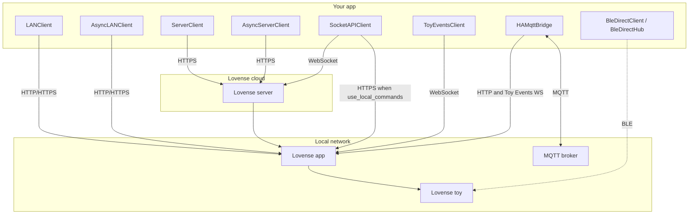

# LovensePy

[](https://opensource.org/licenses/Apache-2.0)

**LovensePy** is a Python client for the [Lovense developer APIs](https://developer.lovense.com): Standard API over LAN (Game Mode) and cloud, Socket API (WebSocket, optional LAN command path), and Toy Events. Optional pieces include a Home Assistant MQTT bridge and direct BLE control.

**Who it is for:** developers building scripts, bots, dashboards, Home Assistant integrations, or experiments. Lovense’s official docs remain the source of truth for protocol behavior; this library wraps those flows in typed, tested Python.

## Install

```bash
pip install lovensepy
```

Optional extras:

```bash
pip install 'lovensepy[mqtt]'   # Home Assistant / MQTT bridge (paho-mqtt)
pip install 'lovensepy[ble]'    # Direct BLE (bleak, pick for examples)
```

## Minimal example (Game Mode)

```python
from lovensepy import LANClient, Actions

client = LANClient("MyApp", "192.168.1.100", port=20011)
client.function_request({Actions.VIBRATE: 10}, time=3)
```

Enable Game Mode in Lovense Remote, use the app host’s IP, and pick the right port (e.g. **20011** for Remote, **34567** for Connect). Full setup, tutorials, and API tables are on **[GitHub Pages](https://koval01.github.io/lovensepy/)** (or browse the [docs](docs/index.md) folder in the repository).

For **`async`/`await`** code, **`AsyncLANClient`**, **`AsyncServerClient`**, **`BleDirectHub`**, and **`BleDirectClient`** all subclass **`LovenseAsyncControlClient`**: same control methods so you can switch transport by changing only construction. See [Connection methods](docs/connection-methods.md#same-control-code-different-transport) and the [API reference](docs/api-reference.md#lovenseasynccontrolclient).

## How clients reach the toy



## Documentation and official APIs

- **Project docs (site):** [koval01.github.io/lovensepy](https://koval01.github.io/lovensepy/) — **source:** [docs/index.md](docs/index.md)
- [Lovense Standard API](https://developer.lovense.com/docs/standard-solutions/standard-api.html)
- [Lovense Socket API](https://developer.lovense.com/docs/standard-solutions/socket-api.html)
- [Toy Events API](https://developer.lovense.com/docs/standard-solutions/toy-events-api.html)

## Changelog

See [CHANGELOG.md](CHANGELOG.md).

## License

**Apache License 2.0** — see [LICENSE](LICENSE) for full text.
