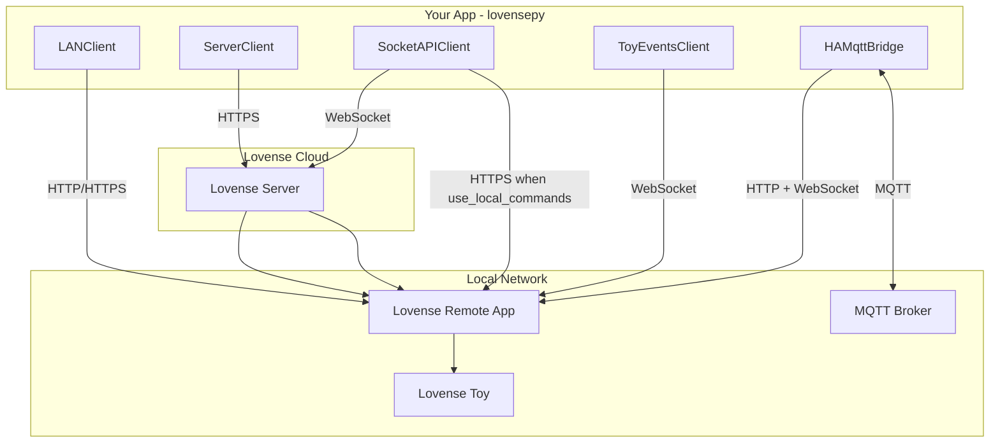
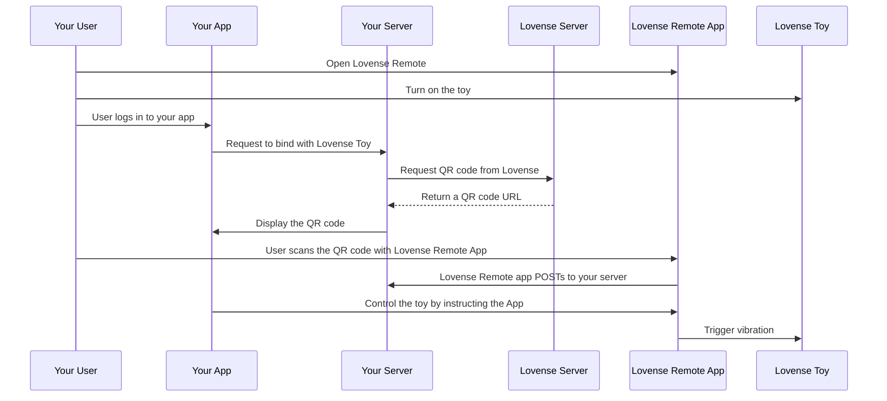
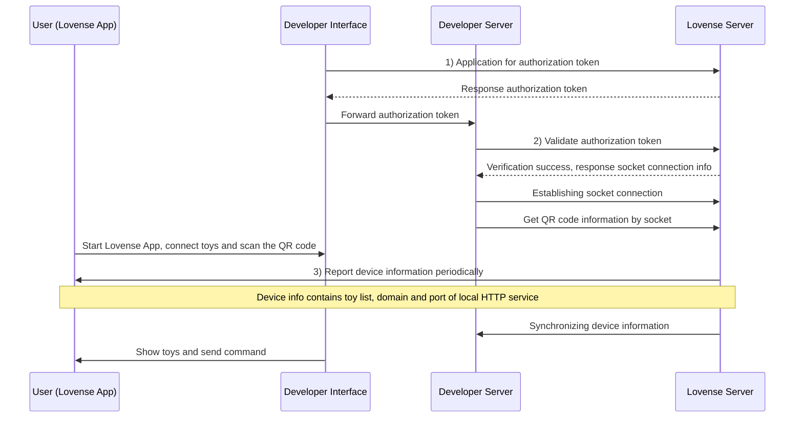

# LovensePy

[](https://opensource.org/licenses/Apache-2.0)

Python client for the **Lovense API**. Supports Standard API (LAN & Server), Standard Socket API, and Toy Events API.

## Table of Contents

- [Features](#features)
- [Prerequisites](#prerequisites)
- [Installation](#installation)
- [Quick Start](#quick-start)
- [API Variants](#api-variants)
  - [API Architecture](#api-architecture)
- [Step-by-Step Tutorials](#step-by-step-tutorials)
  - [LAN Game Mode](#lan-game-mode-tutorial)
  - [Server API + QR Pairing](#server-api--qr-pairing-tutorial)
  - [Socket API](#socket-api-tutorial)
  - [Toy Events](#toy-events-tutorial)
  - [Home Assistant MQTT](#home-assistant-mqtt-tutorial)
  - [FastAPI LAN REST](#fastapi-lan-rest-tutorial)
- [API Reference](#api-reference)
  - [LANClient](#lanclient)
  - [ServerClient](#serverclient)
  - [SocketAPIClient](#socketapiclient)
  - [ToyEventsClient](#toyeventsclient)
  - [HAMqttBridge](#hamqttbridge)
  - [Pattern Players](#pattern-players)
  - [Utilities](#utilities)
- [Appendix](#appendix)
  - [Actions and Presets](#actions-and-presets)
  - [Toy Events Event Types](#toy-events-event-types)
  - [Lovense Flow Diagrams](#lovense-flow-diagrams)
  - [Architecture](#architecture)
  - [HTTPS Certificate](#https-certificate)
  - [Examples](#examples)
  - [Tests](#tests)
- [Links](#links)
- [License](#license)

---

## Features

- **Standard API LAN (Game Mode)**: GetToys, GetToyName, Function, Stop, Pattern, Preset, Position, PatternV2
- **Standard API Server**: Function, Pattern, Preset via Lovense cloud; `get_qr_code` for QR pairing
- **Standard Socket API**: getToken, getSocketUrl, WebSocket client for QR flow and remote control
- **Toy Events API**: Real-time events (toy-list, button-down, function-strength-changed, etc.)
- **Home Assistant MQTT bridge** (optional): MQTT Discovery + control via local Game Mode (`pip install 'lovensepy[mqtt]'`)
- **FastAPI LAN example** (`examples/fastapi_lan_api.py`): HTTP REST + OpenAPI `/docs` for Game Mode, per-motor scheduling, presets/patterns, `/tasks` — see [tutorial](#fastapi-lan-rest-tutorial)

---

## Prerequisites

Before using LovensePy, ensure you have:

- **Lovense Remote** or **Lovense Connect** app installed on your phone or PC
- **Lovense toy** paired with the app
- **Same Wi-Fi network** as the device (required for LAN/Game Mode)
- **Developer token** (for Server/Socket API) — obtain from [Lovense Developer Dashboard](https://developer.lovense.com)
- **Callback URL** (for Server API QR pairing) — e.g. ngrok tunnel or similar to receive pairing callbacks

---

## Installation

```bash
pip install lovensepy
```

MQTT / Home Assistant bridge (installs `paho-mqtt`):

```bash
pip install 'lovensepy[mqtt]'
```

Dependencies: `httpx`, `pydantic`, `websockets`. Optional: `paho-mqtt` (via `[mqtt]`).

---

## Quick Start

Get your first command running in 4 steps:

**Step 1:** Install the package (see [Installation](#installation)).

**Step 2:** Enable Game Mode in Lovense Remote:
- Open Lovense Remote > Discover > Game Mode > Enable LAN
- Note the **IP address** (e.g. `192.168.1.100`) and **port** (20011 for Remote, 34567 for Connect)

**Step 3:** Create a Python script:

```python
from lovensepy import LANClient, Actions

client = LANClient("MyApp", "192.168.1.100", port=20011)
client.function_request({Actions.VIBRATE: 10}, time=3)
```

**Step 4:** Run the script. Your toy should vibrate at level 10 for 3 seconds.

> **Note:** The `time` parameter is in **seconds**. The device holds the level until the next command or until you call `client.stop()`.

---

## API Variants

| API | Client | Auth | Notes |
|-----|--------|------|-------|
| Standard / local | `LANClient` | Game Mode (IP + port) | Lovense Remote: 20011/30011. Connect: 34567 |
| Standard / server | `ServerClient` | token + uid | uid from QR callback. Use `get_qr_code` for pairing |
| Socket / server | `SocketAPIClient` | getToken, getSocketUrl | QR scan, commands via WebSocket |
| Socket / local | `SocketAPIClient(use_local_commands=True)` | same + LAN | Commands via HTTPS to device |
| Socket / local only | `LANClient` | IP + port only | No token, no WebSocket |
| Events API | `ToyEventsClient` | access (appName) | Port 20011. Lovense Remote only |
| Home Assistant | `HAMqttBridge` | MQTT broker + Game Mode LAN IP | MQTT Discovery; commands → `AsyncLANClient`; state via Toy Events |
| Example REST (panels) | `examples/fastapi_lan_api.py` | Game Mode LAN IP + port | FastAPI + OpenAPI; asyncio scheduler; same LAN commands as `LANClient` |

**Flow:** Standard local → HTTP/HTTPS to device. Standard server → HTTPS to Lovense cloud. Socket → WebSocket to cloud (or HTTPS to device when `use_local_commands=True`). Events → WebSocket to device.

### API Architecture



---

## Step-by-Step Tutorials

### LAN Game Mode Tutorial

**Step 1:** Enable Game Mode in Lovense Remote
- Open Lovense Remote > Discover > Game Mode > Enable LAN
- Or Lovense Connect > Scan QR > Other connection modes > IP Address

**Step 2:** Note the IP and port
- Lovense Remote: typically port **20011** (HTTP) or **30011** (HTTPS)
- Lovense Connect: typically port **34567**

**Step 3:** Create the client

```python
from lovensepy import LANClient

client = LANClient("MyApp", "192.168.1.100", port=20011)
```

**Step 4:** Get connected toys

```python
response = client.get_toys()
toys = {toy.id: toy.model_dump() for toy in response.data.toys} if response.data else {}
# toys is {toy_id: toy_info}
```

**Step 5:** Send a Function command (auto-stop)

```python
import time
from lovensepy import Actions

# Vibrate at level 10 for 5 seconds; toy is auto-stopped on context exit.
with client.play({Actions.VIBRATE: 10}, time=5):
    time.sleep(5)
```

**Step 8:** Optional — use Presets or Patterns

```python
from lovensepy import Presets

client.preset_request(Presets.PULSE, time=5)
time.sleep(5)

# Custom pattern: list of strength levels (0-20)
client.pattern_request([5, 10, 15, 20], time=4)
time.sleep(4)

client.stop()
```

**Full example:**

```python
import time
from lovensepy import LANClient, Actions, Presets

client = LANClient("MyApp", "192.168.1.100", port=20011)

# Get toys
toys_response = client.get_toys()
toys = {toy.id: toy.model_dump() for toy in toys_response.data.toys} if toys_response.data else {}
print("Toys:", toys)

# Preset
client.preset_request(Presets.PULSE, time=5)
time.sleep(5)

# Function
client.function_request({Actions.ALL: 5}, time=3)
time.sleep(3)

# Pattern
client.pattern_request([5, 10, 15, 20], time=4)
time.sleep(4)

# Stop
client.stop()
```

---

### Server API + QR Pairing Tutorial

**Step 1:** Get your developer token from the [Lovense Developer Dashboard](https://developer.lovense.com).

**Step 2:** Set up a callback URL (e.g. ngrok) and configure it in the Dashboard. Lovense will POST to this URL when a user scans the QR code.

**Step 3:** Call `get_qr_code` to get the QR image URL and 6-character code

```python
from lovensepy import get_qr_code

qr_data = get_qr_code(developer_token="YOUR_TOKEN", uid="user_123")
qr_url = qr_data["qr"]   # Image URL for user to scan
code = qr_data["code"]   # 6-char code for PC Remote
print(f"Scan QR: {qr_url}")
```

**Step 4:** User scans the QR code in Lovense Remote.

**Step 5:** Lovense POSTs to your callback URL with `uid` and `toys`. Your server receives this and stores the uid.

**Step 6:** Create the ServerClient with the uid from the callback

```python
from lovensepy import ServerClient, Actions

client = ServerClient(developer_token="YOUR_TOKEN", uid="user_123")
```

**Step 7:** Send commands (same as LAN)

```python
import time

client.function_request({Actions.VIBRATE: 10}, time=5)
time.sleep(5)
client.stop()
```

---

### Socket API Tutorial

The Socket API is **async only**. Use `asyncio.run()` to run your async code.

**Step 1:** Get an auth token

```python
from lovensepy import get_token

auth_token = get_token(
    developer_token="YOUR_TOKEN",
    uid="user_123",
    uname="User"
)
```

**Step 2:** Get socket URL info. The `platform` must match the **Website Name** from your Lovense Developer Dashboard exactly.

```python
from lovensepy import get_socket_url

socket_info = get_socket_url(auth_token, platform="Your App")
```

**Step 3:** Build the WebSocket URL

```python
from lovensepy import build_websocket_url

ws_url = build_websocket_url(socket_info, auth_token)
```

**Step 4:** Create the client and connect

```python
import asyncio
from lovensepy import SocketAPIClient

async def main():
    client = SocketAPIClient(ws_url, on_event=lambda e, p: print(e, p))
    await client.connect()  # starts background loops and returns quickly
```

**Step 5:** Request QR code (when `on_socket_io_connected` fires)

```python
    client_ref = []

    def on_connected():
        client_ref[0].send_event("basicapi_get_qrcode_ts", {"ackId": "1"})

    client = SocketAPIClient(ws_url, on_socket_io_connected=on_connected, on_event=...)
    client_ref.append(client)
```

**Step 6:** User scans QR. You receive `basicapi_update_device_info_tc` with the toy list in the payload.

**Step 7:** Send commands when `client.is_socket_io_connected` is True

```python
    if client.is_socket_io_connected:
        client.send_command("Function", "Vibrate:10", time_sec=5, toy="toy_id")
```

**Step 8:** Use `send_command_await` for critical stops (awaits delivery)

```python
    await client.send_command_await("Function", "Stop", time_sec=0, toy="toy_id")
```

**Step 9:** For 24/7 bots, run auto-reconnect loop in background

```python
    # Keep connection alive even after transient disconnects.
    runner = client.start_background(auto_reconnect=True, retry_delay=5.0)
```

You can also use `await client.connect_with_retry(retry_delay=5.0)` directly.

**By local (same LAN):** Pass `use_local_commands=True` — after QR scan, commands go via HTTPS to the device instead of WebSocket.

---

### Toy Events Tutorial

Toy Events is **Lovense Remote only** (port 20011). Lovense Connect does not support Toy Events.

**Step 1:** Ensure you use Lovense Remote with Game Mode enabled. Port is typically 20011.

**Step 2:** Create the client with an event callback

```python
import asyncio
from lovensepy import ToyEventsClient

def on_event(event_type, payload):
    print(event_type, payload)

client = ToyEventsClient(
    "192.168.1.100",
    port=20011,
    app_name="My App",
    on_event=on_event
)
```

**Step 3:** Connect (async)

```python
async def main():
    await client.connect()

asyncio.run(main())
```

**Step 4:** User grants access when Lovense Remote prompts "Allow [My App] to access?"

**Step 5:** Receive events: `toy-list`, `button-down`, `function-strength-changed`, `shake`, etc.

---

### Home Assistant MQTT Tutorial

Use a small **bridge process** on your network: it talks to Lovense **Game Mode** (HTTP + Toy Events WebSocket) and exposes **MQTT Discovery** entities to Home Assistant.

**Requirements**

- MQTT broker reachable from the machine running the bridge (e.g. Mosquitto on `192.168.1.2:1883`)
- Home Assistant **MQTT** integration configured with the same broker
- Lovense **Remote** with **Game Mode** enabled (not Lovense Connect for Toy Events)
- Install: `pip install 'lovensepy[mqtt]'`

**Step 1:** Set environment variables (example for your broker):

```bash
export LOVENSE_LAN_IP=192.168.1.100   # host running Lovense Remote (Game Mode)
export MQTT_HOST=192.168.1.2
export MQTT_PORT=1883
# optional: MQTT_USER, MQTT_PASSWORD, MQTT_TOPIC_PREFIX=lovensepy
```

**Step 2:** Run the example bridge:

```bash
python examples/ha_mqtt_bridge.py
```

**Step 3:** In Home Assistant, open **Settings → Devices & Services → MQTT**. New devices should appear under MQTT discovery (per-toy numbers for each supported motor, **Stop** button, **Preset** select, **Battery** sensor).

**Step 4:** Grant Toy Events access when Lovense Remote prompts (same as [Toy Events](#toy-events-tutorial)).

**Topic layout** (default prefix `lovensepy`): command topics are `lovensepy/<safe_toy_id>/<feature>/set` (e.g. `vibrate`, `rotate`, `preset`, `stop`). Bridge availability is published retained on `lovensepy/bridge/status` (`online` / `offline`).


**Programmatic use:**

```python
import asyncio
from lovensepy import HAMqttBridge

async def main():
    bridge = HAMqttBridge(
        "192.168.1.2",
        1883,
        lan_ip="192.168.1.100",
        mqtt_username=None,
        mqtt_password=None,
    )
    await bridge.start()
    # ... keep running ...
    await bridge.stop()

asyncio.run(main())
```

---

### FastAPI LAN REST Tutorial

Example **HTTP API** on your LAN for dashboards, scripts, or mobile apps: it wraps **Game Mode** (`LANClient`) with **FastAPI**, **OpenAPI** (`/docs`), and an **asyncio** scheduler (per-motor `Function` slots, preset/pattern sessions, `GET /tasks`).

**Requirements:** `pip install fastapi uvicorn lovensepy`

**Step 1:** Environment (minimum):

```bash
export LOVENSE_LAN_IP=192.168.1.100   # host running Lovense Remote (Game Mode)
# optional: LOVENSE_LAN_PORT=20011 LOVENSE_APP_NAME=... LOVENSE_TOY_IDS=id1,id2
# optional: LOVENSE_SESSION_MAX_SEC=60  # server /tasks row when preset/pattern time is 0
```

**Step 2:** Run:

```bash
uvicorn examples.fastapi_lan_api:app --host 0.0.0.0 --port 8000
# or: fastapi dev examples/fastapi_lan_api.py
```

**Step 3:** Open **http://127.0.0.1:8000/docs** — try `GET /toys`, `POST /command/preset`, `GET /tasks`, stops (`/command/stop/...` and batch variants).

**Behavior notes**

- Re-sending the **same** preset/pattern for the same toy **extends** the session and **sends another LAN command** with the new `time` (Lovense stops after each command’s `timeSec` otherwise).
- `GET /tasks` combines **function** rows (`kind: function`) and **preset/pattern** rows (`kind: preset` / `pattern`); timestamps include `started_at` (UTC) and `started_monotonic_sec` for stable `remaining_sec` math.

See also the [Examples](#examples) table row for `examples/fastapi_lan_api.py`.

---

## API Reference

### LANClient

Standard API LAN (Game Mode) client. Sends commands via HTTP/HTTPS to the Lovense app on the same network.

For async applications (Discord, Telegram, FastAPI, workers), use `AsyncLANClient`.

#### Constructor

```python
LANClient(
    app_name: str,
    local_ip: str | None = None,
    *,
    domain: str | None = None,
    port: int = 20011,
    ssl_port: int = 30011,
    use_https: bool = False,
    verify_ssl: bool = True,
    timeout: float = 10.0,
)
```

| Parameter | Type | Default | Description |
|-----------|------|---------|-------------|
| `app_name` | str | — | Application name (e.g. "MyApp") |
| `local_ip` | str | None | Device IP (e.g. "192.168.1.100"). Use with `domain=None`. |
| `domain` | str | None | Pre-built domain (e.g. "192-168-1-100.lovense.club"). Use when you have domain from Socket API. |
| `port` | int | 20011 | HTTP port (Lovense Remote: 20011, Connect: 34567) |
| `ssl_port` | int | 30011 | HTTPS port |
| `use_https` | bool | False | Use HTTPS instead of HTTP |
| `verify_ssl` | bool | True | Verify SSL cert. If False, uses fingerprint pinning. |
| `timeout` | float | 10.0 | Request timeout in seconds |

**Example:**

```python
client = LANClient("MyApp", "192.168.1.100", port=20011)
```

**Class method:** `LANClient.from_device_info(app_name, domain, https_port=30011, **kwargs)` — Create from Socket API device info (e.g. `basicapi_update_device_info_tc` payload).

#### Methods

| Method | Parameters | Returns | Description |
|--------|------------|---------|-------------|
| `get_toys()` | — | `GetToysResponse` | Get connected toys. Uses a typed `data.toys[]` list. |
| `get_toys_name()` | — | `GetToyNameResponse` | Get connected toy names. |
| `function_request(actions, time=0, loop_on_time=None, loop_off_time=None, toy_id=None, stop_previous=None)` | `actions`: dict like `{Actions.VIBRATE: 10}`; `time`: seconds | `CommandResponse` | Send Function command. `time` in seconds. |
| `stop(toy_id=None)` | `toy_id`: str or list | `CommandResponse` | Stop all motors. |
| `preset_request(name, time=0, toy_id=None)` | `name`: Presets enum or str | `CommandResponse` | Send Preset (pulse, wave, etc.). |
| `pattern_request(pattern, actions=None, interval=100, time=0, toy_id=None)` | `pattern`: list of 0–20; `interval`: ms | `CommandResponse` | Custom pattern. |
| `pattern_request_raw(strength, rule="V:1;F:;S:100#", time=0, toy_id=None)` | Raw rule/strength strings | `CommandResponse` | Advanced pattern. |
| `position_request(value, toy_id=None)` | `value`: 0–100 | `CommandResponse` | Position for Solace Pro. |
| `pattern_v2_setup(actions)` | `actions`: list of `{ts, pos}` | `CommandResponse` | PatternV2 Setup. |
| `pattern_v2_play(toy_id=None, start_time=None, offset_time=None, time_ms=None)` | — | `CommandResponse` | PatternV2 Play. |
| `pattern_v2_init_play(actions, toy_id=None, ...)` | — | `CommandResponse` | PatternV2 Setup + Play. |
| `pattern_v2_stop(toy_id=None)` | — | `CommandResponse` | PatternV2 Stop. |
| `pattern_v2_sync_time()` | — | `CommandResponse` | PatternV2 SyncTime. |
| `send_command(command_data, timeout=None)` | Raw command dict | `dict` | Low-level; returns raw dict. Raises `LovenseError` on failures. |
| `decode_response(response)` | Response dict | str | Human-readable response string. |

**Example:**

```python
import time

with client.play({Actions.VIBRATE: 10}, time=5, toy_id="T123"):
    time.sleep(5)
```

---

### ServerClient

Standard API Server client. Sends commands via Lovense cloud. Requires developer token and uid from QR pairing.

#### Constructor

```python
ServerClient(
    developer_token: str,
    uid: str,
    timeout: float = 10.0,
)
```

| Parameter | Type | Description |
|-----------|------|-------------|
| `developer_token` | str | From Lovense Developer Dashboard |
| `uid` | str | User ID from QR pairing callback |
| `timeout` | float | Request timeout |

#### Methods

Same command methods as LANClient: `function_request`, `stop`, `pattern_request`, `preset_request`, `send_command`, `decode_response`. Note: Server `pattern_request` uses `(rule, strength, time, toy_id)` — different signature from LAN.

---

### AsyncServerClient

Async version of the Standard API Server client for server-side bots.

#### Lifecycle and resource management

`AsyncServerClient` is an async client and should be closed when you stop the process:

```python
from lovensepy import AsyncServerClient, Actions

async def run_once():
    async with AsyncServerClient("YOUR_DEV_TOKEN", "USER_UID") as client:
        await client.function_request({Actions.VIBRATE: 10}, time=2)
```

If you don't use `async with`, call `await client.aclose()` explicitly.

#### Per-request timeout overrides

High-level async methods accept `timeout` to override the client default for that single call.

---

### AsyncLANClient

Async version of LAN client for local applications (runs on the same network as the Lovense device).
If you're building a production bot that runs on your server, prefer `AsyncServerClient` or `SocketAPIClient` instead.

#### Lifecycle and resource management

`AsyncLANClient` reuses HTTP sessions for better throughput. Close it when done:

```python
from lovensepy import AsyncLANClient, Actions

async def run_once():
    async with AsyncLANClient("MyBot", "192.168.1.100", port=20011) as client:
        await client.function_request({Actions.VIBRATE: 10}, time=2)
```

If you do not use `async with`, call `await client.aclose()` explicitly.

#### Per-request timeout overrides

All high-level async methods accept `timeout` to override client default timeout for that call:

```python
toys = await client.get_toys(timeout=2.0)  # quick call
await client.pattern_request([5, 10, 15, 20], time=20, timeout=15.0)  # longer call
```

#### Concurrency safety

For HTTPS with `verify_ssl=False`, certificate fingerprint verification is guarded internally to avoid duplicate concurrent checks when many commands hit the same endpoint at once.

---

### Server-side multi-session bot pattern (Discord/Telegram)

When your bot runs on a server, you typically use:
- `AsyncServerClient` (Standard API Server): cloud HTTP requests (token + `uid`)
- `SocketAPIClient` (Socket API): cloud WebSocket + event loop

Key idea: your backend must authenticate the incoming request, then resolve *the correct* Lovense session from your own stored mapping (e.g. in a database). Never accept a Lovense `uid` (or socket auth token) directly from the user request.

This avoids:
- data conflicts (shared mutable objects across users)
- accidental session mix-ups (sending commands to someone else’s `uid`)
- security issues (exposing or trusting client-provided session identifiers)

```python
import asyncio
from lovensepy import AsyncServerClient, Actions


class ServerSessionPool:
    """
    Keeps per-user clients in memory.

    user_id: your app user ID (Discord/Telegram).
    lovense_uid: stored in your DB after QR pairing / OAuth-like flow.
    """

    def __init__(self):
        self._clients: dict[str, AsyncServerClient] = {}
        self._lock = asyncio.Lock()

    async def get_or_create(self, user_id: str, *, lovense_uid: str) -> AsyncServerClient:
        async with self._lock:
            client = self._clients.get(user_id)
            if client is None:
                client = AsyncServerClient(
                    developer_token="YOUR_DEV_TOKEN",
                    uid=lovense_uid,
                    timeout=5.0,
                )
                self._clients[user_id] = client
            return client

    async def close_session(self, user_id: str) -> None:
        async with self._lock:
            client = self._clients.pop(user_id, None)
        if client is not None:
            await client.aclose()

    async def shutdown(self) -> None:
        async with self._lock:
            clients = list(self._clients.values())
            self._clients.clear()
        await asyncio.gather(*(c.aclose() for c in clients), return_exceptions=True)


sessions = ServerSessionPool()


async def handle_vibrate(user_id: str, level: int) -> None:
    # 1) Authenticate request on your server (Discord/Telegram auth).
    # 2) Look up lovense_uid for this authenticated user from your DB.
    lovense_uid = "LOOKED_UP_FROM_YOUR_DB"

    # 3) Resolve the correct per-user client.
    client = await sessions.get_or_create(user_id, lovense_uid=lovense_uid)

    # 4) Use per-request timeout if needed.
    await client.function_request({Actions.VIBRATE: level}, time=2, timeout=3.0)
```

Scaling notes (server-side):
- Use one shared event loop and non-blocking handlers (`await` everywhere).
- Reuse clients per user/session; avoid creating them per command.
- Put an upper bound on concurrency (e.g. `asyncio.Semaphore`) if a single user or a spike of users can spam commands.
- Add idle cleanup (TTL) so inactive sessions are closed automatically.
- For very large loads, shard bot workers/processes and keep per-process session maps.
- If you use `SocketAPIClient`, create and keep one WebSocket client per Lovense user session (per `ws_url`/auth token), and route commands through the correct per-session instance just like above.

---

### SocketAPIClient

Async WebSocket client for Socket API. Commands via WebSocket (or LAN HTTPS when `use_local_commands=True`).

#### Constructor

```python
SocketAPIClient(
    ws_url: str,
    *,
    use_local_commands: bool = False,
    app_name: str = "lovensepy",
    raise_on_disconnect: bool = False,
    on_socket_open: Callable | None = None,
    on_socket_close: Callable | None = None,
    on_socket_error: Callable[[Exception], ...] | None = None,
    on_socket_io_connected: Callable | None = None,
    on_event: Callable[[str, Any], ...] | None = None,
)
```

| Parameter | Type | Description |
|-----------|------|-------------|
| `ws_url` | str | WebSocket URL from `build_websocket_url` |
| `use_local_commands` | bool | Send commands via LAN HTTPS when device on same network |
| `app_name` | str | App name for local commands |
| `raise_on_disconnect` | bool | Raise `ConnectionError` when sending while disconnected |
| `on_socket_open`, `on_socket_close`, `on_socket_error` | Callable | Connection lifecycle callbacks |
| `on_socket_io_connected` | Callable | Fired when Socket.IO handshake complete |
| `on_event` | Callable | Fired for each Socket.IO event `(event_name, payload)` |

#### Methods

| Method | Description |
|--------|-------------|
| `connect()` | Async. Connect and start background ping/recv tasks (non-blocking). |
| `run_forever()` | Async. Connect and block until disconnected. |
| `start_background(auto_reconnect=False, retry_delay=5.0)` | Start `run_forever` (or reconnect loop) as a task. |
| `connect_with_retry(retry_delay=5.0, max_retries=None)` | Reconnect loop for 24/7 bots. |
| `wait_closed()` | Wait until current connection fully closes. |
| `disconnect()` | Close connection. |
| `send_command(command, action, time_sec=0, toy=None, ...)` | Send command (non-blocking). |
| `send_command_await(command, action, ...)` | Send command and await delivery. Use for stops. |
| `send_event(event, payload=None)` | Send raw Socket.IO event. |
| `on(event_name)` | Decorator to register per-event handlers. |
| `add_event_handler(event_name, handler)` | Register per-event handler programmatically. |

Event routing example:

```python
@client.on("basicapi_update_device_info_tc")
async def on_device_info(payload):
    print("Device info:", payload)
```

#### Properties

| Property | Type | Description |
|----------|------|-------------|
| `is_socket_io_connected` | bool | True when Socket.IO handshake done and ready for commands |
| `is_using_local_commands` | bool | True when commands go via LAN HTTPS |

---

### ToyEventsClient

Async WebSocket client for Toy Events API. Receives real-time events from toys. Lovense Remote only, port 20011.

#### Constructor

```python
ToyEventsClient(
    ip: str,
    port: int = 20011,
    use_https: bool = False,
    https_port: int = 30011,
    app_name: str = "lovensepy",
    *,
    on_open: Callable | None = None,
    on_close: Callable | None = None,
    on_error: Callable[[Exception], ...] | None = None,
    on_event: Callable[[str, Any], ...] | None = None,
)
```

#### Methods and Properties

| Method/Property | Description |
|-----------------|-------------|
| `connect()` | Async. Connect, request access, receive events until disconnected. |
| `disconnect()` | Close connection. |
| `is_connected` | True if WebSocket connected. |
| `is_access_granted` | True when user granted access in Lovense Remote. |

---

### HAMqttBridge

MQTT bridge for **Home Assistant** (MQTT Discovery). Uses `AsyncLANClient` for commands and `ToyEventsClient` for battery / strength updates. **Requires** optional dependency `paho-mqtt` (`pip install 'lovensepy[mqtt]'`).

Import: `from lovensepy import HAMqttBridge` (lazy-loaded) or `from lovensepy.integrations.mqtt import HAMqttBridge`.

#### Constructor

```python
HAMqttBridge(
    mqtt_host: str,
    mqtt_port: int = 1883,
    *,
    lan_ip: str,
    lan_port: int = 20011,
    toy_events_port: int | None = None,
    app_name: str = "lovensepy_ha",
    topic_prefix: str = "lovensepy",
    mqtt_username: str | None = None,
    mqtt_password: str | None = None,
    mqtt_client_id: str | None = None,
    refresh_interval: float = 45.0,
    use_https: bool = False,
    use_toy_events: bool = True,
)
```

| Parameter | Description |
|-----------|-------------|
| `mqtt_host`, `mqtt_port` | MQTT broker (Home Assistant integration uses the same broker). |
| `lan_ip`, `lan_port` | Lovense Remote Game Mode HTTP API (`/command`). |
| `toy_events_port` | Toy Events WebSocket (default: same as `lan_port`, usually 20011). |
| `topic_prefix` | Base prefix for state/command topics and discovery device grouping. |
| `use_toy_events` | If False, only polling `GetToys` is used (no live battery/strength). |

#### Methods and properties

| Method / property | Description |
|-------------------|-------------|
| `async start()` | Connect MQTT, subscribe, publish discovery, start refresh + Toy Events tasks. |
| `async stop()` | Cancel tasks, publish `offline`, disconnect. |
| `availability_topic` | Retained bridge status topic (e.g. `lovensepy/bridge/status`). |

---

### Pattern Players

High-level API for sine waves and combo patterns.

#### SyncPatternPlayer

For use with `LANClient`. Synchronous.

```python
SyncPatternPlayer(client: LANClient, toys: dict[str, dict] | GetToysResponse)
```

| Method | Parameters | Description |
|--------|------------|-------------|
| `play_sine_wave(toy_id, feature, duration_sec=5, num_steps=100, stop_prev_first=True)` | `feature`: e.g. "Vibrate1" | Play sine wave on one feature. |
| `play_combo(targets, duration_sec=4, num_steps=100)` | `targets`: `[(toy_id, feature), ...]` | Play combo with random phases. |
| `stop(toy_id)` | — | Stop toy. |
| `features(toy_id)` | — | Get features for toy. |

**Example:**

```python
player = SyncPatternPlayer(client, toys)
player.play_sine_wave("T123", "Vibrate1", duration_sec=5)
player.play_combo([("T1", "Vibrate1"), ("T2", "Vibrate")], duration_sec=4)
player.stop("T123")
```

#### AsyncPatternPlayer

For use with `SocketAPIClient`. Same methods, async (use `await`).

```python
player = AsyncPatternPlayer(client, toys)
await player.play_sine_wave("T123", "Vibrate1", duration_sec=5)
await player.stop("T123")
```

---

### Utilities

| Function | Parameters | Returns | Description |
|----------|------------|---------|-------------|
| `get_token(developer_token, uid, uname=None, utoken=None, timeout=10)` | — | str | Get auth token for Socket API. Raises on error. |
| `get_socket_url(auth_token, platform, timeout=10)` | `platform`: Website Name from Dashboard | dict | Get socket info dict. |
| `build_websocket_url(socket_info, auth_token)` | — | str | Build full wss:// URL. |
| `get_qr_code(developer_token, uid, uname=None, utoken=None, timeout=10)` | — | dict | Get QR for Server API. Returns `{qr, code}`. See security note in docstring. |
| `features_for_toy(toy)` | `toy`: dict from GetToys | list[str] | Get features (e.g. `["Vibrate1", "Rotate"]`). |
| `stop_actions(toy)` | `toy`: dict | dict | Build `{Vibrate1: 0, ...}` to stop. |

---

## Appendix

### Actions and Presets

#### Actions (function types)

| Action | Range | Toys |
|--------|-------|------|
| `Actions.VIBRATE` | 0–20 | Most |
| `Actions.VIBRATE1`, `VIBRATE2`, `VIBRATE3` | 0–20 | Edge, Diamo, multi-motor |
| `Actions.ROTATE` | 0–20 | Nora, Max, etc. |
| `Actions.PUMP` | 0–3 | Max 2 |
| `Actions.THRUSTING` | 0–20 | Solace, Mission |
| `Actions.FINGERING` | 0–20 | Solace |
| `Actions.SUCTION` | 0–20 | Max 2 |
| `Actions.DEPTH` | 0–3 | Solace Pro |
| `Actions.STROKE` | 0–100 | Solace Pro |
| `Actions.OSCILLATE` | 0–20 | Some toys |
| `Actions.ALL` | 0–20 | All motors at once |
| `Actions.STOP` | — | Stop |

**Usage:**

```python
client.function_request({Actions.VIBRATE: 10}, time=5)
client.function_request({Actions.VIBRATE1: 5, Actions.VIBRATE2: 10}, time=3)
```

#### Presets (built-in patterns)

| Preset | Description |
|--------|-------------|
| `Presets.PULSE` | Pulse pattern |
| `Presets.WAVE` | Wave pattern |
| `Presets.FIREWORKS` | Fireworks pattern |
| `Presets.EARTHQUAKE` | Earthquake pattern |

**Usage:**

```python
client.preset_request(Presets.PULSE, time=5)
```

---

### Toy Events Event Types

| Event | When |
|-------|------|
| `toy-list` | Toys added/removed/enabled |
| `toy-status` | Toy connected/disconnected |
| `button-down`, `button-up`, `button-pressed` | User pressed toy button |
| `function-strength-changed` | User changed level in app |
| `shake`, `shake-frequency-changed` | Shake sensor |
| `battery-changed`, `depth-changed`, `motion-changed` | Sensor updates |
| `event-closed` | Game mode disabled |
| `access-granted` | User granted access (internal) |
| `pong` | Ping response (internal) |

---

### Lovense Flow Diagrams

The following sequence diagrams illustrate the flows described in the Lovense developer documentation.

**Server API — QR pairing flow:**



**Socket API — authorization and connection flow:**



---

### Architecture

- **Clients**: LANClient, ServerClient, SocketAPIClient, ToyEventsClient, HAMqttBridge — command building, protocols, MQTT bridge
- **Transport**: HttpTransport (POST JSON), WsTransport (WebSocket)
- **Security**: Certificate fingerprint verification for HTTPS (port 30011/30011) when `verify_ssl=False`

---

### HTTPS Certificate

For local HTTPS (ports 30011/30011), lovensepy verifies the Lovense certificate fingerprint instead of disabling SSL. Fingerprint in `lovensepy.security.LOVENSE_HTTPS_FINGERPRINT`.

---

### Examples

| File | Description |
|------|-------------|
| `examples/lan_game_mode.py` | LAN Game Mode — get toys, presets, functions, patterns |
| `examples/patterns_demo.py` | Sine waves and combos with SyncPatternPlayer |
| `examples/server_api.py` | Server API with token and uid |
| `examples/socket_api_full.py` | Socket API with QR flow and command sending |
| `examples/toy_events_full.py` | Toy Events — receive real-time events |
| `examples/ha_mqtt_bridge.py` | Home Assistant MQTT bridge (Game Mode + broker) |
| `examples/fastapi_lan_api.py` | FastAPI REST + OpenAPI for Game Mode; per-motor tasks, presets/patterns, `/tasks`, batch stops — **[tutorial](#fastapi-lan-rest-tutorial)** |

Run with env vars, e.g. `LOVENSE_LAN_IP=192.168.1.100 python examples/lan_game_mode.py`

**FastAPI:** `LOVENSE_LAN_IP=192.168.1.100 uvicorn examples.fastapi_lan_api:app --host 0.0.0.0 --port 8000` — details in [FastAPI LAN REST Tutorial](#fastapi-lan-rest-tutorial).

---

### Tests

#### Install

```bash
pip install -e ".[dev]"
```

#### Full library validation (single command)

Runs all test phases in strict order:
- unit
- async transport/socket-client unit
- Home Assistant MQTT unit
- LAN integration (patterns/commands/local control)
- Toy Events integration
- Socket integration (server + by-local flow)
- Standard Server integration

```bash
python -m tests.run_all
```

Optional:

```bash
python -m tests.run_all --stop-on-fail
```

#### Unit tests (no devices)

```bash
pytest tests/test_unit.py -v
pytest tests/test_home_assistant_mqtt_unit.py -v
```

#### Integration tests

Integration tests require Lovense hardware and/or a developer token. Set environment variables for the test mode you use, then run the corresponding test file.

**Test modes and required env vars:**

| Test file | Mode | Required env vars |
|-----------|------|-------------------|
| `test_local.py` | Standard / local | `LOVENSE_LAN_IP`, `LOVENSE_LAN_PORT` (20011 Remote, 34567 Connect) |
| `test_standard_server.py` | Standard / server | `LOVENSE_DEV_TOKEN`, `LOVENSE_UID` — or `LOVENSE_QR_PAIRING=1` + ngrok |
| `test_socket.py` | Socket / server | `LOVENSE_DEV_TOKEN`, `LOVENSE_UID`, `LOVENSE_PLATFORM` |
| `test_socket.py::test_by_local` | Socket / local | Same as server + device on same LAN |
| `test_toy_events.py` | Toy Events | `LOVENSE_LAN_IP`, `LOVENSE_TOY_EVENTS_PORT` (20011) |
| `test_home_assistant_mqtt_unit.py` | MQTT bridge (unit) | None — uses fakes, requires `paho-mqtt` (included in `.[dev]`) |

**Example env setup:**

```bash
export LOVENSE_LAN_IP=192.168.1.100
export LOVENSE_LAN_PORT=34567          # Lovense Connect
export LOVENSE_DEV_TOKEN=your_token
export LOVENSE_UID=your_uid
export LOVENSE_PLATFORM="Your App"
export LOVENSE_TOY_EVENTS_PORT=20011   # Toy Events (Lovense Remote only)
export LOVENSE_QR_PAIRING=1
export LOVENSE_CALLBACK_PORT=8765      # ngrok or cloudflared
```

**Run integration tests:**

```bash
pytest tests/test_local.py -v -s
pytest tests/test_standard_server.py -v -s
pytest tests/test_socket.py -v -s
pytest tests/test_toy_events.py -v -s
```

---

## Links

- [Home Assistant MQTT Discovery](https://www.home-assistant.io/integrations/mqtt/#mqtt-discovery)
- [Lovense Standard API](https://developer.lovense.com/docs/standard-solutions/standard-api.html)
- [Lovense Socket API](https://developer.lovense.com/docs/standard-solutions/socket-api.html)
- [Toy Events API](https://developer.lovense.com/docs/standard-solutions/toy-events-api.html)

---

## License

**Apache License 2.0** — see [LICENSE](LICENSE) for full text.
