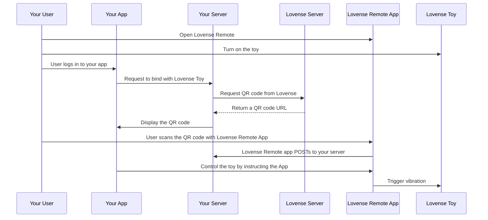
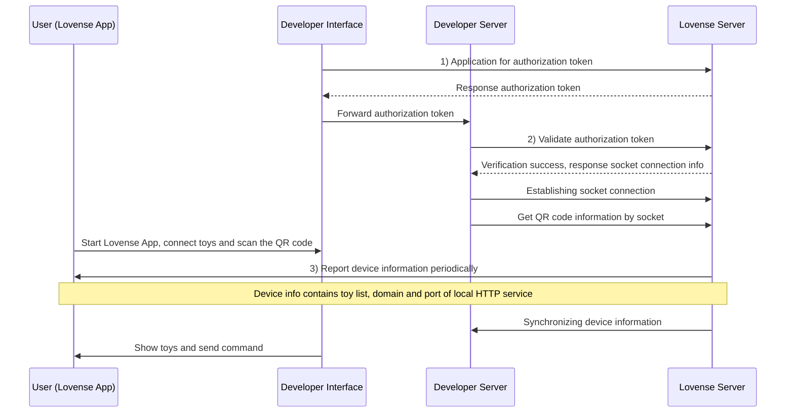

# Appendix

### Actions and Presets

#### Actions (function types)

| Action | Range | Toys |
|--------|-------|------|
| `Actions.VIBRATE` | 0–20 | Most |
| `Actions.VIBRATE1`, `VIBRATE2`, `VIBRATE3` | 0–20 | Edge, Diamo, multi-motor |
| `Actions.ROTATE` | 0–20 | Nora, Max, etc. |
| `Actions.PUMP` | 0–3 | Max 2 |
| `Actions.THRUSTING` | 0–20 | Solace, Mission |
| `Actions.FINGERING` | 0–20 | Solace |
| `Actions.SUCTION` | 0–20 | Max 2 |
| `Actions.DEPTH` | 0–3 | Solace Pro |
| `Actions.STROKE` | 0–100 | Solace Pro |
| `Actions.OSCILLATE` | 0–20 | Some toys |
| `Actions.ALL` | 0–20 | All motors at once |
| `Actions.STOP` | — | Stop |

**Usage:**

```python
client.function_request({Actions.VIBRATE: 10}, time=5)
client.function_request({Actions.VIBRATE1: 5, Actions.VIBRATE2: 10}, time=3)
```

#### Presets (built-in patterns)

| Preset | Description |
|--------|-------------|
| `Presets.PULSE` | Pulse pattern |
| `Presets.WAVE` | Wave pattern |
| `Presets.FIREWORKS` | Fireworks pattern |
| `Presets.EARTHQUAKE` | Earthquake pattern |

**Usage:**

```python
client.preset_request(Presets.PULSE, time=5)
```

**Direct BLE:** the hub/client still take the same `Presets` names, but UART uses **`Pat:{n};`** or **`Preset:{n};`** with an integer **n** — not `Pat:pulse`. :class:`~lovensepy.ble_direct.client.BleDirectClient` defaults to **`Pat`** (Lovense Connect); the **FastAPI BLE** service defaults to **`Preset`** when toys are added via **`/ble/connect`** (override with **`LOVENSEPY_BLE_PRESET_UART`**). The default name→**n** map is `PRESET_BLE_PAT_INDEX` (typically pulse=1 … earthquake=4); slot numbers can differ by firmware.

---

### Toy Events Event Types

| Event | When |
|-------|------|
| `toy-list` | Toys added/removed/enabled |
| `toy-status` | Toy connected/disconnected |
| `button-down`, `button-up`, `button-pressed` | User pressed toy button |
| `function-strength-changed` | User changed level in app |
| `shake`, `shake-frequency-changed` | Shake sensor |
| `battery-changed`, `depth-changed`, `motion-changed` | Sensor updates |
| `event-closed` | Game mode disabled |
| `access-granted` | User granted access (internal) |
| `pong` | Ping response (internal) |

---

### Lovense Flow Diagrams

The following sequence diagrams illustrate the flows described in the Lovense developer documentation.

**Server API — QR pairing flow:**



**Socket API — authorization and connection flow:**



---

### Architecture

- **Clients**: LANClient, ServerClient, SocketAPIClient, ToyEventsClient, HAMqttBridge — command building, protocols, MQTT bridge
- **Transport**: HttpTransport (POST JSON), WsTransport (WebSocket)
- **Security**: Certificate fingerprint verification for HTTPS (port 30011) when `verify_ssl=False`

---

### HTTPS Certificate

For local HTTPS (port 30011), lovensepy verifies the Lovense certificate fingerprint instead of disabling SSL. Fingerprint in `lovensepy.security.LOVENSE_HTTPS_FINGERPRINT`.

---

### Examples

| File | Description |
|------|-------------|
| `examples/lan_game_mode.py` | LAN Game Mode — get toys, presets, functions, patterns |
| `examples/patterns_demo.py` | Sine waves and combos with SyncPatternPlayer |
| `examples/server_api.py` | Server API with token and uid |
| `examples/socket_api_full.py` | Socket API with QR flow and command sending |
| `examples/toy_events_full.py` | Toy Events — receive real-time events |
| `examples/ha_mqtt_bridge.py` | Home Assistant MQTT bridge (Game Mode + broker) |
| `examples/ble_direct_scan_and_two.py` | BLE CLI: scan (default **LVS-** names), interactive multiselect (`pick`), or `--no-tui` + numbers; pulse test; optional **`--wave`** sine sweeps per toy / dual motors / all together |
| `examples/ble_direct_preset_multi.py` | Direct BLE: send the same **preset** (`pulse` / `wave` / …) to **any number** of toy addresses in parallel (`asyncio.gather`) — pass one address or many; for a **single hub object** use `BleDirectHub` (see [Direct BLE](direct-ble.md)) |
| `lovensepy.services.fastapi` / `examples/fastapi_lan_api.py` (shim) | FastAPI REST + OpenAPI; LAN (Game Mode) or BLE (`LOVENSE_SERVICE_MODE`); per-motor tasks, presets/patterns, `/tasks`, batch stops — **[tutorial](tutorials/fastapi-lan-rest.md#fastapi-lan-rest-tutorial)** |

Run with env vars, e.g. `LOVENSE_LAN_IP=192.168.1.100 python examples/lan_game_mode.py`

**FastAPI:** `pip install 'lovensepy[service]'` then `LOVENSE_LAN_IP=192.168.1.100 uvicorn lovensepy.services.fastapi.app:app --host 0.0.0.0 --port 8000` (BLE: `LOVENSE_SERVICE_MODE=ble` and `lovensepy[ble]`) — [tutorial](tutorials/fastapi-lan-rest.md#fastapi-lan-rest-tutorial).

---

### Tests

#### Install

```bash
pip install -e ".[dev]"
```

#### Full library validation (single command)

Runs all test phases in strict order:
- unit
- async transport/client unit
- Socket client unit
- Home Assistant MQTT unit
- BLE / UART / WebSocket / Socket cleanup unit tests (no hardware)
- LAN integration (patterns/commands/local control)
- Toy Events integration
- Socket integration (server + by-local flow)
- Standard Server integration
- connection-methods sequential (env-dependent)
- BLE integration (hardware; skips if no `LVS-*` devices)

```bash
python -m tests.run_all
```

Optional:

```bash
python -m tests.run_all --stop-on-fail
```

#### Unit tests (no devices)

```bash
pytest tests/test_unit.py -v
pytest tests/test_home_assistant_mqtt_unit.py -v
```

#### Semgrep (SAST, same as CI)

```bash
semgrep scan --config auto lovensepy --error
```

`semgrep` is included in the `.[dev]` extra.

#### Integration tests

Integration tests require Lovense hardware and/or a developer token. Set environment variables for the test mode you use, then run the corresponding test file.

**Test modes and required env vars:**

| Test file | Mode | Required env vars |
|-----------|------|-------------------|
| `test_local.py` | Standard / local | `LOVENSE_LAN_IP`, `LOVENSE_LAN_PORT` (20011 Remote, 34567 Connect) |
| `test_standard_server.py` | Standard / server | `LOVENSE_DEV_TOKEN`, `LOVENSE_UID` — or `LOVENSE_QR_PAIRING=1` + ngrok |
| `test_socket.py` | Socket / server | `LOVENSE_DEV_TOKEN`, `LOVENSE_UID`, `LOVENSE_PLATFORM` |
| `test_socket.py::test_by_local` | Socket / local | Same as server + device on same LAN |
| `test_toy_events.py` | Toy Events | `LOVENSE_LAN_IP`, `LOVENSE_TOY_EVENTS_PORT` (20011) |
| `test_home_assistant_mqtt_unit.py` | MQTT bridge (unit) | None — uses fakes, requires `paho-mqtt` (included in `.[dev]`) |
| `test_connection_methods_sequential.py` | Mixed modes | LAN / Socket / Server env vars as used by each subtest |
| `test_ble_direct_integration.py` | Direct BLE | Hardware, `bleak` (install `.[ble]` or `.[dev]`); optional `LOVENSE_BLE_SCAN_TIMEOUT`, `LOVENSE_BLE_STEP_SEC` |

**Example env setup:**

```bash
export LOVENSE_LAN_IP=192.168.1.100
export LOVENSE_LAN_PORT=34567          # Lovense Connect
export LOVENSE_DEV_TOKEN=your_token
export LOVENSE_UID=your_uid
export LOVENSE_PLATFORM="Your App"
export LOVENSE_TOY_EVENTS_PORT=20011   # Toy Events (Lovense Remote only)
export LOVENSE_QR_PAIRING=1
export LOVENSE_CALLBACK_PORT=8765      # ngrok or cloudflared
# Optional — direct BLE integration test tuning
export LOVENSE_BLE_SCAN_TIMEOUT=15
export LOVENSE_BLE_STEP_SEC=1.2
export LOVENSE_BLE_INTER_STEP_SEC=0.2   # pause after each stop (try 0.3–0.5 if flaky)
```

**Run integration tests:**

```bash
pytest tests/test_local.py -v -s
pytest tests/test_standard_server.py -v -s
pytest tests/test_socket.py -v -s
pytest tests/test_toy_events.py -v -s
pytest tests/test_ble_direct_integration.py -v -s
```

Direct BLE (`test_ble_direct_integration.py`) needs `bleak` and at least one `LVS-*` advertiser in range; disconnect Lovense Remote from toys first (single central). Tune timing with `LOVENSE_BLE_SCAN_TIMEOUT` and `LOVENSE_BLE_STEP_SEC` if needed.

## External links

- [Home Assistant MQTT Discovery](https://www.home-assistant.io/integrations/mqtt/#mqtt-discovery)
- [Lovense Standard API](https://developer.lovense.com/docs/standard-solutions/standard-api.html)
- [Lovense Socket API](https://developer.lovense.com/docs/standard-solutions/socket-api.html)
- [Toy Events API](https://developer.lovense.com/docs/standard-solutions/toy-events-api.html)

