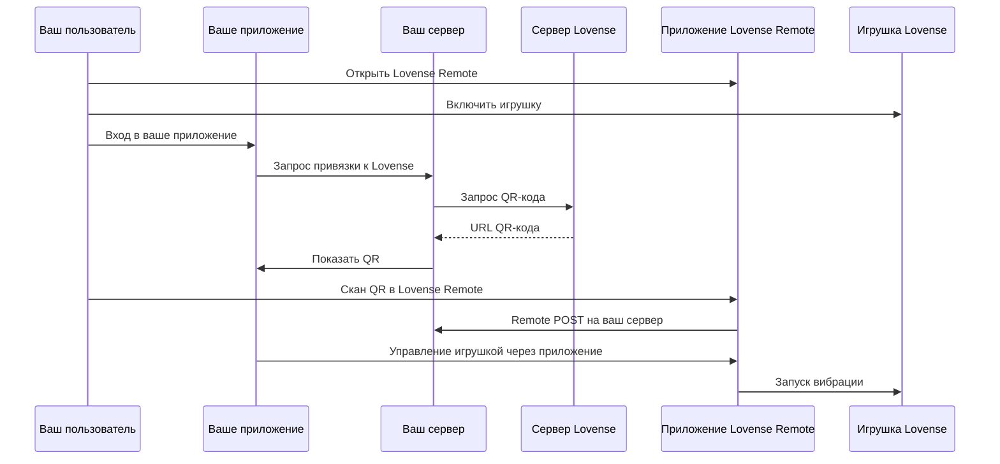
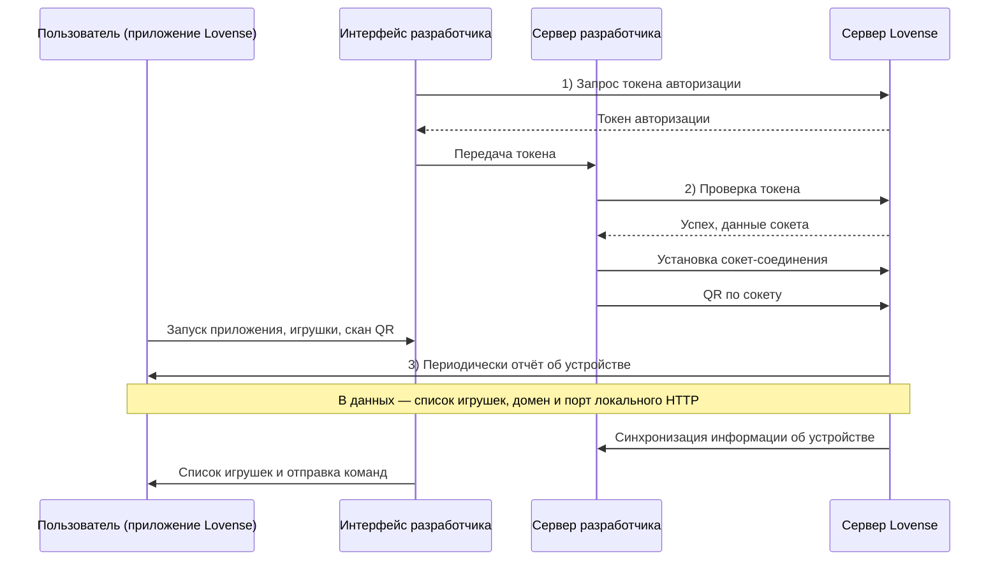

# Приложение

### Действия и пресеты

#### Actions (типы функций)

| Действие | Диапазон | Игрушки |
|----------|----------|---------|
| `Actions.VIBRATE` | 0–20 | Большинство |
| `Actions.VIBRATE1`, `VIBRATE2`, `VIBRATE3` | 0–20 | Edge, Diamo, мультимотор |
| `Actions.ROTATE` | 0–20 | Nora, Max и др. |
| `Actions.PUMP` | 0–3 | Max 2 |
| `Actions.THRUSTING` | 0–20 | Solace, Mission |
| `Actions.FINGERING` | 0–20 | Solace |
| `Actions.SUCTION` | 0–20 | Max 2 |
| `Actions.DEPTH` | 0–3 | Solace Pro |
| `Actions.STROKE` | 0–100 | Solace Pro |
| `Actions.OSCILLATE` | 0–20 | Некоторые модели |
| `Actions.ALL` | 0–20 | Все моторы сразу |
| `Actions.STOP` | — | Стоп |

**Использование:**

```python
client.function_request({Actions.VIBRATE: 10}, time=5)
client.function_request({Actions.VIBRATE1: 5, Actions.VIBRATE2: 10}, time=3)
```

#### Пресеты (встроенные паттерны)

| Пресет | Описание |
|--------|----------|
| `Presets.PULSE` | Пульс |
| `Presets.WAVE` | Волна |
| `Presets.FIREWORKS` | Фейерверк |
| `Presets.EARTHQUAKE` | Землетрясение |

**Использование:**

```python
client.preset_request(Presets.PULSE, time=5)
```

**Прямой BLE:** хаб/клиент принимают те же имена `Presets`, но по UART уходит **`Pat:{n};`** или **`Preset:{n};`** с целым **n** — не `Pat:pulse`. :class:`~lovensepy.ble_direct.client.BleDirectClient` по умолчанию **`Pat`**; **FastAPI BLE** при добавлении игрушек через **`/ble/connect`** по умолчанию **`Preset`** (переопределение — **`LOVENSEPY_BLE_PRESET_UART`**). Карта имя→**n** по умолчанию — `PRESET_BLE_PAT_INDEX` (обычно pulse=1 … earthquake=4); номера слотов могут отличаться по прошивке.

---

### Типы событий Toy Events

| Событие | Когда |
|---------|-------|
| `toy-list` | Игрушки добавлены/удалены/включены |
| `toy-status` | Игрушка подключена/отключена |
| `button-down`, `button-up`, `button-pressed` | Нажата кнопка на игрушке |
| `function-strength-changed` | Пользователь сменил уровень в приложении |
| `shake`, `shake-frequency-changed` | Датчик встряхивания |
| `battery-changed`, `depth-changed`, `motion-changed` | Обновления сенсоров |
| `event-closed` | Game mode выключен |
| `access-granted` | Пользователь выдал доступ (внутреннее) |
| `pong` | Ответ на ping (внутреннее) |

---

### Диаграммы потоков Lovense

Ниже — последовательностные диаграммы потоков из документации разработчика Lovense.

**Server API — сопряжение по QR:**



**Socket API — авторизация и подключение:**



---

### Архитектура

- **Клиенты:** LANClient, ServerClient, SocketAPIClient, ToyEventsClient, HAMqttBridge (управление LAN или BLE) — сборка команд, протоколы, MQTT-мост
- **Транспорт:** HttpTransport (POST JSON), WsTransport (WebSocket)
- **Безопасность:** проверка отпечатка сертификата для HTTPS (порт 30011) при `verify_ssl=False`

---

### Сертификат HTTPS {: #https-certificate}

Для локального HTTPS (порт 30011) lovensepy проверяет отпечаток сертификата Lovense вместо отключения SSL. Отпечаток в `lovensepy.security.LOVENSE_HTTPS_FINGERPRINT`.

---

### Примеры {: #examples}

| Файл | Описание |
|------|----------|
| `examples/lan_game_mode.py` | LAN Game Mode — список игрушек, пресеты, функции, паттерны |
| `examples/patterns_demo.py` | Синусоиды и комбо с SyncPatternPlayer |
| `examples/server_api.py` | Server API с token и uid |
| `examples/socket_api_full.py` | Socket API: QR и отправка команд |
| `examples/toy_events_full.py` | Toy Events — события в реальном времени |
| `lovensepy.services.mqtt_bridge` / `lovensepy-mqtt` | Сервис MQTT-моста Home Assistant (Game Mode или BLE + брокер); `examples/ha_mqtt_bridge.py` — обёртка |
| `examples/ble_direct_scan_and_two.py` | BLE CLI: скан (имена по умолчанию **LVS-**), интерактивный мультивыбор (`pick`) или `--no-tui` + номера; тест pulse; опционально **`--wave`** — синус по игрушке / моторам / всем |
| `examples/ble_direct_preset_multi.py` | Прямой BLE: один и тот же **пресет** (`pulse` / `wave` / …) на **любое число** адресов параллельно (`asyncio.gather`) — один адрес или много; для **одного хаба** используйте `BleDirectHub` (см. [Прямой BLE](direct-ble.md)) |
| `examples/ble_direct_send_uart_once.py` | Прямой BLE: подключиться к одной игрушке, отправить одну «сырую» UART-команду и отключиться (диагностика/ручные команды) |
| `lovensepy.services.fastapi` / `examples/fastapi_lan_api.py` (обёртка) | FastAPI REST + OpenAPI; LAN (Game Mode) или BLE (`LOVENSE_SERVICE_MODE`); задачи по моторам, пресеты/паттерны, `/tasks`, пакетные стопы — **[руководство](tutorials/fastapi-lan-rest.md#fastapi-lan-rest-tutorial)** |

Запуск с переменными окружения, например `LOVENSE_LAN_IP=192.168.1.100 python examples/lan_game_mode.py`

**FastAPI:** `pip install 'lovensepy[service]'` затем `LOVENSE_LAN_IP=192.168.1.100 uvicorn lovensepy.services.fastapi.app:app --host 0.0.0.0 --port 8000` (BLE: `LOVENSE_SERVICE_MODE=ble` и `lovensepy[ble]`) — [руководство](tutorials/fastapi-lan-rest.md#fastapi-lan-rest-tutorial).

---

### Тесты

#### Установка

```bash
pip install -e ".[dev]"
```

#### Полная проверка библиотеки (одна команда)

Запускает все фазы тестов строго по порядку:
- unit
- async transport/client unit
- unit Socket-клиента
- unit Home Assistant MQTT
- BLE / UART / WebSocket / Socket cleanup (без железа)
- LAN integration (паттерны/команды/локальное управление)
- Toy Events integration
- Socket integration (server + by-local)
- Standard Server integration
- connection-methods последовательно (зависит от окружения)
- BLE integration (железо; пропуск без устройств `LVS-*`)

```bash
python -m tests.run_all
```

Опционально:

```bash
python -m tests.run_all --stop-on-fail
```

#### Unit-тесты (без устройств)

```bash
pytest tests/test_unit.py -v
pytest tests/test_home_assistant_mqtt_unit.py -v
```

#### Semgrep (SAST, как в CI)

```bash
semgrep scan --config auto lovensepy --error
```

`semgrep` входит в extra `.[dev]`.

#### Интеграционные тесты

Нужны устройства Lovense и/или токен разработчика. Задайте переменные окружения для нужного режима и запустите соответствующий файл.

**Режимы и переменные:**

| Файл теста | Режим | Нужные переменные |
|------------|-------|-------------------|
| `test_local.py` | Standard / локально | `LOVENSE_LAN_IP`, `LOVENSE_LAN_PORT` (20011 Remote, 34567 Connect) |
| `test_standard_server.py` | Standard / сервер | `LOVENSE_DEV_TOKEN`, `LOVENSE_UID` — или `LOVENSE_QR_PAIRING=1` + ngrok |
| `test_socket.py` | Socket / сервер | `LOVENSE_DEV_TOKEN`, `LOVENSE_UID`, `LOVENSE_PLATFORM` |
| `test_socket.py::test_by_local` | Socket / локально | То же + устройство в той же LAN |
| `test_toy_events.py` | Toy Events | `LOVENSE_LAN_IP`, `LOVENSE_TOY_EVENTS_PORT` (20011) |
| `test_home_assistant_mqtt_unit.py` | MQTT-мост (unit) | Нет — фейки, нужен `paho-mqtt` (в `.[dev]`) |
| `test_connection_methods_sequential.py` | Смешанный | LAN / Socket / Server по подтестам |
| `test_ble_direct_integration.py` | Прямой BLE | Железо, `bleak` (`.[ble]` или `.[dev]`); опционально `LOVENSE_BLE_SCAN_TIMEOUT`, `LOVENSE_BLE_STEP_SEC` |

**Пример окружения:**

```bash
export LOVENSE_LAN_IP=192.168.1.100
export LOVENSE_LAN_PORT=34567          # Lovense Connect
export LOVENSE_DEV_TOKEN=your_token
export LOVENSE_UID=your_uid
export LOVENSE_PLATFORM="Your App"
export LOVENSE_TOY_EVENTS_PORT=20011   # Toy Events (только Lovense Remote)
export LOVENSE_QR_PAIRING=1
export LOVENSE_CALLBACK_PORT=8765      # ngrok или cloudflared
# Опционально — настройка интеграционного BLE-теста
export LOVENSE_BLE_SCAN_TIMEOUT=15
export LOVENSE_BLE_STEP_SEC=1.2
export LOVENSE_BLE_INTER_STEP_SEC=0.2   # пауза после каждого стопа (0.3–0.5 при флаках)
```

**Запуск интеграционных тестов:**

```bash
pytest tests/test_local.py -v -s
pytest tests/test_standard_server.py -v -s
pytest tests/test_socket.py -v -s
pytest tests/test_toy_events.py -v -s
pytest tests/test_ble_direct_integration.py -v -s
```

Прямой BLE (`test_ble_direct_integration.py`) требует `bleak` и хотя бы одного рекламодателя `LVS-*` в зоне действия; отключите Remote от игрушек (один central). При необходимости подстройте время через `LOVENSE_BLE_SCAN_TIMEOUT` и `LOVENSE_BLE_STEP_SEC`.

## Внешние ссылки

- [Home Assistant MQTT Discovery](https://www.home-assistant.io/integrations/mqtt/#mqtt-discovery)
- [Lovense Standard API](https://developer.lovense.com/docs/standard-solutions/standard-api.html)
- [Lovense Socket API](https://developer.lovense.com/docs/standard-solutions/socket-api.html)
- [Toy Events API](https://developer.lovense.com/docs/standard-solutions/toy-events-api.html)
