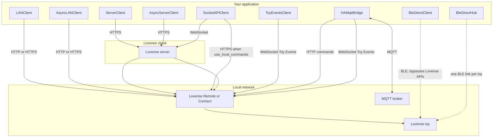

# Connection methods and architecture

This page summarizes how each client reaches the toy or the Lovense app. For direct BLE (no Lovense app on the path), see [Direct BLE](direct-ble.md).

## Same control code, different transport

For **Standard**-shaped control (toy list, Function, Pattern, Preset, Stop), use the same method names and keep your script structure; only the **client constructor** and **bootstrap** step change:

| Role | Sync (scripts) | Async (`async def`) |
|------|----------------|---------------------|
| LAN (Game Mode) | `LANClient(app_name, ip, port=…)` | `AsyncLANClient(…)` |
| Standard Server (cloud + `uid`) | `ServerClient(developer_token, uid)` | `AsyncServerClient(…)` |
| Direct BLE | `BleDirectHubSync()` then `discover_and_connect(…)` | `BleDirectHub()` then `await discover_and_connect(…)` |

The **async** clients in the right column (plus `BleDirectClient` for a single peripheral) all subclass **`LovenseAsyncControlClient`**: one abstract API you can type-hint in your own code so swapping LAN ↔ Standard Server ↔ BLE is a constructor change only. Sync `LANClient` / `ServerClient` follow the same *method names* but are not part of that ABC (they stay blocking; see [API reference — LovenseAsyncControlClient](api-reference.md#lovenseasynccontrolclient)).

Shared surface (where the backend supports it): `actions`, `presets`, `error_codes`, `get_toys`, `get_toys_name`, `function_request`, `play`, `preset_request`, `pattern_request` (list form on LAN, Server, and BLE hub), `stop`, `send_command`, `decode_response`.

**Targeting**

- **`toy_id`:** pass a single id or a list so a command applies only to those toys (`None` = all). Same parameter on LAN, Server, and BLE hub.
- **Per-motor / per-channel:** use keys such as **`Actions.VIBRATE1`** and **`Actions.VIBRATE2`** in the `function_request` dict (and `actions=[…]` on `pattern_request` where supported). Discover channels with **`features_for_toy`** on each toy row — see the [LAN tutorial](tutorials/lan.md#step-5-one-toy-at-a-time-or-one-motor-at-a-time) and [Direct BLE](direct-ble.md#per-toy-and-per-motor-dual-vibrators).

**Caveats**

- **BLE:** `function_request(..., time>0)` runs the timer **inside** the library (blocking until stop). For the same *feel* as the LAN tutorial’s `with client.play(..., time=5): time.sleep(5)`, use `play(..., time=0)` and your own `sleep` on BLE — see [Direct BLE](direct-ble.md).
- **Server / LAN:** `function_request` returns after the HTTP call; timing is enforced by the app/toy path.
- **PatternV2, Position, some edge commands:** not all are implemented on every transport — check the API reference for `BleDirectClient` / hub vs LAN.

## API variants

| API | Client | Auth | Notes |
|-----|--------|------|-------|
| Standard / local | `LANClient` or `AsyncLANClient` | Game Mode (IP + port) | Lovense Remote: 20011 / 30011. Connect: 34567 |
| Standard / server | `ServerClient` or `AsyncServerClient` | token + uid | uid from QR callback. Use `get_qr_code` for pairing |
| Socket / server | `SocketAPIClient` | getToken, getSocketUrl | QR scan, commands via WebSocket |
| Socket / local | `SocketAPIClient(use_local_commands=True)` | same + LAN | Commands via HTTPS to device |
| Socket / local only | `LANClient` | IP + port only | No token, no WebSocket |
| Events API | `ToyEventsClient` | access (appName) | Port 20011. Lovense Remote only |
| Home Assistant | `HAMqttBridge` | MQTT broker + Game Mode LAN IP | MQTT Discovery; commands → `AsyncLANClient`; state via Toy Events |
| Direct BLE | `BleDirectHubSync` / `BleDirectHub` / `BleDirectClient` | BLE address (peripheral) | No Lovense Remote on the path; **best-effort** UART; often **exclusive** with the app’s BLE link |
| Example REST (panels) | `lovensepy.services.fastapi` (`[service]` extra) | `LOVENSE_SERVICE_MODE=lan` + Game Mode IP, or `=ble` + scan/connect | FastAPI + OpenAPI; asyncio scheduler; LAN or BLE backend |

## How traffic flows

- **Standard (local):** HTTP or HTTPS from your code to the Lovense app on the LAN; the app controls the toy.
- **Standard (server):** HTTPS from your code to Lovense cloud; cloud reaches the app, then the toy.
- **Socket API:** WebSocket to Lovense cloud for pairing and events; optionally HTTPS to the app on the LAN when `use_local_commands=True`.
- **Toy Events:** WebSocket from your code to the Lovense app for live toy and session events.
- **Direct BLE:** Radio link from your machine to the toy; bypasses Lovense HTTP and WebSocket APIs.
- **MQTT bridge:** Your MQTT broker on one side; HTTP commands and Toy Events WebSocket to the Lovense app on the other.

## Architecture diagram

`LANClient` and `ServerClient` have async twins (`AsyncLANClient`, `AsyncServerClient`) that use the same network paths and implement `LovenseAsyncControlClient`. `BleDirectHub` owns one `BleDirectClient` (one BLE link) per registered toy; `BleDirectHubSync` exposes the same hub API synchronously for scripts.

## HTTPS to the app

For local HTTPS (port 30011), LovensePy verifies the Lovense certificate fingerprint instead of disabling TLS. See [HTTPS Certificate](appendix.md#https-certificate).
