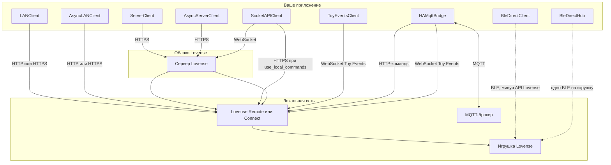

# Способы подключения и архитектура

Здесь кратко описано, как каждый клиент доходит до игрушки или приложения Lovense. Для прямого BLE (без приложения Lovense на пути) см. [Прямой BLE](direct-ble.md).

## Один код управления, разный транспорт {: #same-control-code-different-transport}

Для управления в стиле **Standard** (список игрушек, Function, Pattern, Preset, Stop) используйте те же имена методов и структуру скрипта; меняются только **конструктор клиента** и шаг **подключения**:

| Роль | Синхронно (скрипты) | Async (`async def`) |
|------|---------------------|---------------------|
| LAN (Game Mode) | `LANClient(app_name, ip, port=…)` | `AsyncLANClient(…)` |
| Standard Server (облако + `uid`) | `ServerClient(developer_token, uid)` | `AsyncServerClient(…)` |
| Прямой BLE | `BleDirectHubSync()`, затем `discover_and_connect(…)` | `BleDirectHub()`, затем `await discover_and_connect(…)` |

**Асинхронные** клиенты в правом столбце (плюс `BleDirectClient` для одного периферийного устройства) наследуют **`LovenseAsyncControlClient`**: один абстрактный API, который можно аннотировать в своём коде, чтобы менять LAN ↔ Standard Server ↔ BLE только сменой конструктора. Синхронные `LANClient` / `ServerClient` повторяют те же *имена методов*, но не входят в этот ABC (остаются блокирующими; см. [Справочник API — LovenseAsyncControlClient](api-reference.md#lovenseasynccontrolclient)).

Общая поверхность (где бэкенд поддерживает): `actions`, `presets`, `error_codes`, `get_toys`, `get_toys_name`, `function_request`, `play`, `preset_request`, `pattern_request` (список на LAN, Server и BLE-хабе), `stop`, `send_command`, `decode_response`.

**Выбор цели**

- **`toy_id`:** передайте один id или список, чтобы команда касалась только этих игрушек (`None` = все). Тот же параметр на LAN, Server и BLE-хабе.
- **По мотору / каналу:** используйте ключи вроде **`Actions.VIBRATE1`** и **`Actions.VIBRATE2`** в словаре `function_request` (и `actions=[…]` в `pattern_request`, где поддерживается). Каналы смотрите в **`features_for_toy`** для каждой строки игрушки — см. [руководство LAN](tutorials/lan.md#step-5-one-toy-at-a-time-or-one-motor-at-a-time) и [Прямой BLE](direct-ble.md#per-toy-and-per-motor-dual-vibrators).

**Ограничения**

- **BLE:** `function_request(..., time>0)` запускает таймер **внутри** библиотеки (блокирует до остановки). Чтобы поведение было как в LAN-руководстве с `with client.play(..., time=5): time.sleep(5)`, на BLE используйте `play(..., time=0)` и свой `sleep` — см. [Прямой BLE](direct-ble.md).
- **Server / LAN:** `function_request` возвращается после HTTP; время обеспечивает цепочка приложение/игрушка.
- **PatternV2, Position, часть редких команд:** не везде реализованы — смотрите справочник для `BleDirectClient` / хаба против LAN.

## Варианты API

| API | Клиент | Аутентификация | Замечания |
|-----|--------|----------------|-----------|
| Standard / локально | `LANClient` или `AsyncLANClient` | Game Mode (IP + порт) | Lovense Remote: 20011 / 30011. Connect: 34567 |
| Standard / сервер | `ServerClient` или `AsyncServerClient` | token + uid | uid из callback QR. Для сопряжения — `get_qr_code` |
| Socket / сервер | `SocketAPIClient` | getToken, getSocketUrl | QR, команды по WebSocket |
| Socket / локально | `SocketAPIClient(use_local_commands=True)` | то же + LAN | Команды по HTTPS к устройству |
| Socket / только локально | `LANClient` | только IP + порт | Без токена и WebSocket |
| Events API | `ToyEventsClient` | access (appName) | Порт 20011. Только Lovense Remote |
| Home Assistant | `HAMqttBridge` | MQTT-брокер + IP LAN Game Mode, **или** MQTT + BLE (`transport="ble"`) | MQTT Discovery; команды → `AsyncLANClient` или `BleDirectHub`; Toy Events только в LAN-режиме |
| Прямой BLE | `BleDirectHubSync` / `BleDirectHub` / `BleDirectClient` | BLE-адрес (периферия) | Без Lovense Remote на пути; UART **по возможности**; часто **эксклюзивно** с BLE приложения |
| Пример REST (панели) | `lovensepy.services.fastapi` (extra `[service]`) | `LOVENSE_SERVICE_MODE=lan` + IP Game Mode или `=ble` + скан/подключение | FastAPI + OpenAPI; планировщик asyncio; бэкенд LAN или BLE |

## Как идёт трафик

- **Standard (локально):** HTTP или HTTPS из вашего кода в приложение Lovense в LAN; приложение управляет игрушкой.
- **Standard (сервер):** HTTPS из вашего кода в облако Lovense; облако достучится до приложения, затем до игрушки.
- **Socket API:** WebSocket в облако Lovense для сопряжения и событий; опционально HTTPS к приложению в LAN при `use_local_commands=True`.
- **Toy Events:** WebSocket из вашего кода в приложение Lovense для живых событий игрушки и сессии.
- **Прямой BLE:** радиоканал с вашей машины на игрушку; обходит HTTP и WebSocket API Lovense.
- **MQTT-мост:** с одной стороны ваш MQTT-брокер; с другой — HTTP-команды и WebSocket Toy Events к приложению Lovense.

## Схема архитектуры

У `LANClient` и `ServerClient` есть асинхронные пары (`AsyncLANClient`, `AsyncServerClient`) с теми же сетевыми путями и реализацией `LovenseAsyncControlClient`. `BleDirectHub` держит по одному `BleDirectClient` (одно BLE-соединение) на зарегистрированную игрушку; `BleDirectHubSync` даёт тот же API хаба синхронно для скриптов.

## HTTPS к приложению

Для локального HTTPS (порт 30011) LovensePy проверяет отпечаток сертификата Lovense вместо отключения TLS. См. [Сертификат HTTPS](appendix.md#https-certificate).
