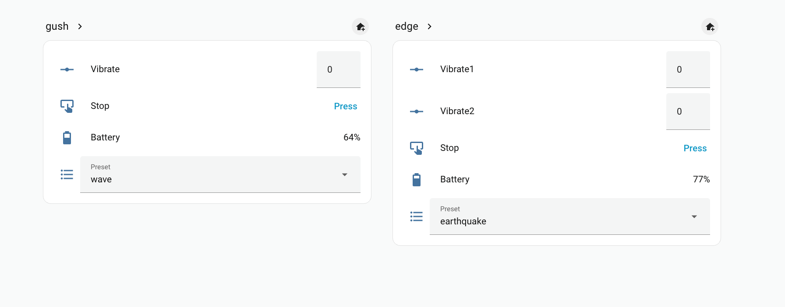

# Home Assistant MQTT bridge

Run a small **bridge process** on your network: it uses Lovense **Game Mode** (HTTP plus Toy Events WebSocket) and publishes **MQTT Discovery** entities to Home Assistant.

## Requirements

- MQTT broker reachable from the machine running the bridge (for example Mosquitto on `192.168.1.2:1883`)
- Home Assistant **MQTT** integration using the same broker
- Lovense **Remote** with **Game Mode** enabled (not Lovense Connect for Toy Events)
- `pip install 'lovensepy[mqtt]'`

### Step 1: Environment variables

```bash
export LOVENSE_LAN_IP=192.168.1.100   # host running Lovense Remote (Game Mode)
export MQTT_HOST=192.168.1.2
export MQTT_PORT=1883
# optional: MQTT_USER, MQTT_PASSWORD, MQTT_TOPIC_PREFIX=lovensepy
```

### Step 2: Example bridge

```bash
python examples/ha_mqtt_bridge.py
```

### Step 3: Home Assistant

In Home Assistant, open **Settings**, then **Devices & Services**, then **MQTT**. New devices should appear under MQTT discovery (per-toy controls for supported motors, **Stop**, **Preset**, **Battery**, and similar).

### Step 4: Toy Events permission

Grant Toy Events access when Lovense Remote prompts (same flow as the [Toy Events](toy-events.md#toy-events-tutorial) tutorial).

## Topic layout

Default prefix `lovensepy`: command topics look like `lovensepy/<safe_toy_id>/<feature>/set` (for example `vibrate`, `rotate`, `preset`, `stop`). The bridge publishes retained availability on `lovensepy/bridge/status` (`online` / `offline`).



## Programmatic use

```python
import asyncio
from lovensepy import HAMqttBridge

async def main():
    bridge = HAMqttBridge(
        "192.168.1.2",
        1883,
        lan_ip="192.168.1.100",
        mqtt_username=None,
        mqtt_password=None,
    )
    await bridge.start()
    # ... keep running ...
    await bridge.stop()

asyncio.run(main())
```
